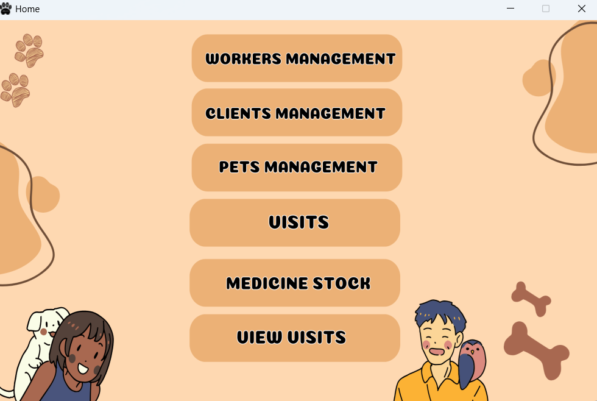
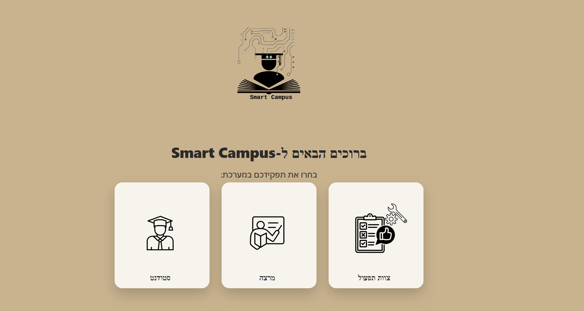
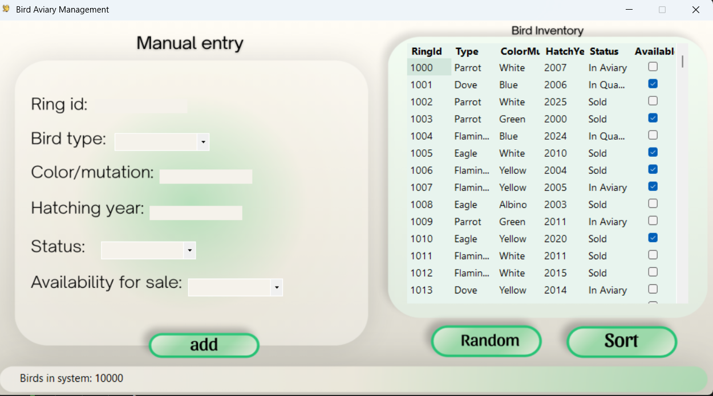

# Hi, I’m Yahav 👋

**Software Engineering student** · building end-to-end products & MVPs  
I enjoy integrating **AI capabilities** into practical projects, and I care about clean product flow, UX clarity, and modern UI.

 

---

## Featured projects

- **Vet Clinic** *(team project)* — WinForms veterinary clinic management system with SQLite database, role-based access, client/pet management, visit forms, inventory handling, and validations  
  👉 https://github.com/yahav11/VetClinic

- **Smart Campus** *(team project)* — classroom reservation and issue reporting system built with Flask and SQLite, including AI-assisted triage  
  👉 https://github.com/yahav11/Smart-Campus

- **Work Hours Tracking System** — full-stack attendance tracking system with authentication, reporting, and real-time UI, built using Python, Streamlit, and PostgreSQL  
  👉 https://github.com/yahav11/Work--Hours--Tracking-System

- **Bird Aviary Management** — WinForms inventory management system for bird records, including validation, random data generation, sorting algorithms, reports, and unit tests  
  👉 https://github.com/yahav11/BirdAviaryManagement

- **AI Study Planner** — study planning demo using OpenAI API  
  👉 https://github.com/yahav11/ai-study-planner

---

## Project previews

<table>
  <tr>
    <td align="center" width="33%">
      
       
      <b>Vet Clinic</b>
    </td>
    <td align="center" width="33%">
      
       
      <b>Smart Campus</b>
    </td>
    <td align="center" width="33%">
      
       
      <b>Bird Aviary</b>
    </td>
  </tr>
</table>

---

## Design focus

I’m engineering-driven, but I care deeply about **UX clarity**, product feel, and making projects look modern — not like a 2009 government website 😭

---

## Tech I used in projects

  
  
  
  
  
  
  
  
  
  

 

  Thanks for stopping by ✨

